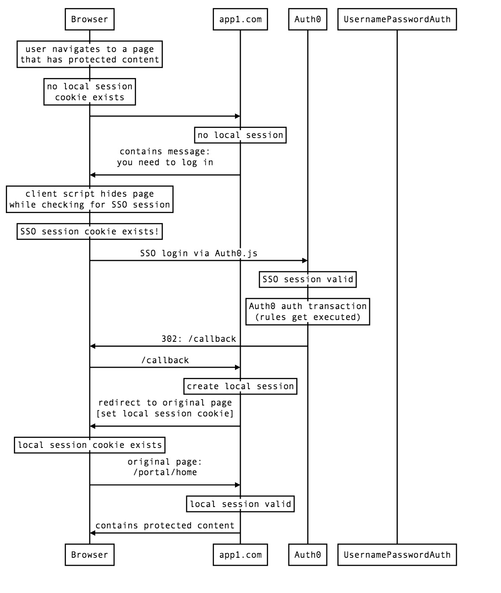

# Existing SSO Session Flow

This is the scenario where the user has already logged in via a different website (ex: app2.com) and is now browsing to app1.com.
And app1.com is configured to attempt to automatically log them in on any page request if they already have an existing SSO session.



```
participant Browser
participant app1.com
participant Auth0
participant UsernamePasswordAuth

Note over Browser: user navigates to a page\nthat has protected content
Note over Browser: no local session\ncookie exists
Browser->app1.com:
Note over app1.com: no local session
app1.com->Browser: contains message:\nyou need to log in
Note over Browser: client script hides page\nwhile checking for SSO session
Note over Browser: SSO session cookie exists!
Browser->Auth0: SSO login via Auth0.js
Note over Auth0: SSO session valid
Note over Auth0: Auth0 auth transaction\n(rules get executed)
Auth0->Browser: 302: /callback
Browser->app1.com: /callback
Note over app1.com: create local session
app1.com->Browser: redirect to original page\n[set local session cookie]
Note over Browser: local session cookie exists
Browser->app1.com: original page:\n/portal/home
Note over app1.com: local session valid
app1.com->Browser: contains protected content
```
