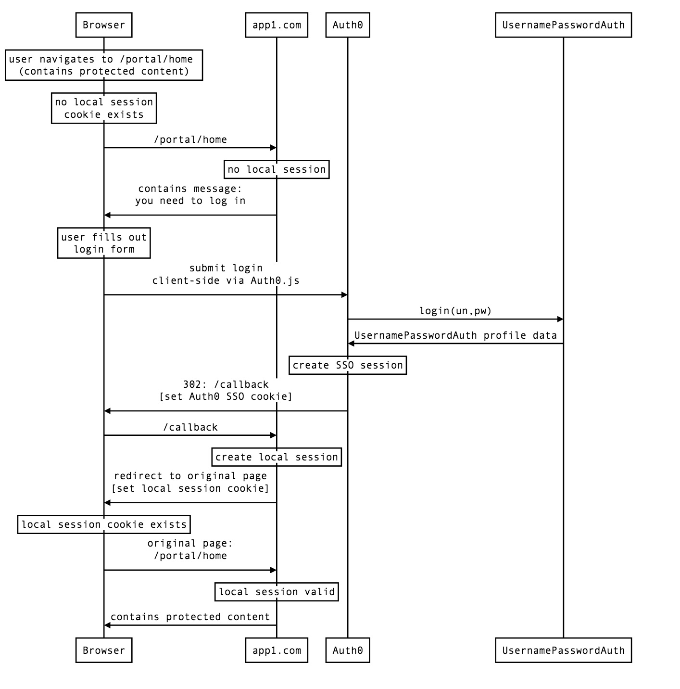

# New SSO Session Flow

This is the scenario where the user is logging in for the first time (in this case to app1.com).
They will need to authenticate with Auth0 username-password-authentication and a new SSO session will be created within Auth0.



```
participant Browser
participant app1.com
participant Auth0
participant UsernamePasswordAuth

Note over Browser: user navigates to /portal/home \n(contains protected content)
Note over Browser: no local session\ncookie exists
Browser->app1.com: /portal/home
Note over app1.com: no local session
app1.com->Browser: contains message:\nyou need to log in
Note over Browser: user fills out\nlogin form
Browser->Auth0: submit login\nclient-side via Auth0.js
Auth0->UsernamePasswordAuth: login(un,pw)
UsernamePasswordAuth-Auth0: UsernamePasswordAuth profile data
Note over Auth0: create SSO session
Auth0->Browser: 302: /callback\n[set Auth0 SSO cookie]
Browser->app1.com: /callback
Note over app1.com: create local session
app1.com->Browser: redirect to original page\n[set local session cookie]
Note over Browser: local session cookie exists
Browser->app1.com: original page:\n/portal/home
Note over app1.com: local session valid
app1.com->Browser: contains protected content
```
